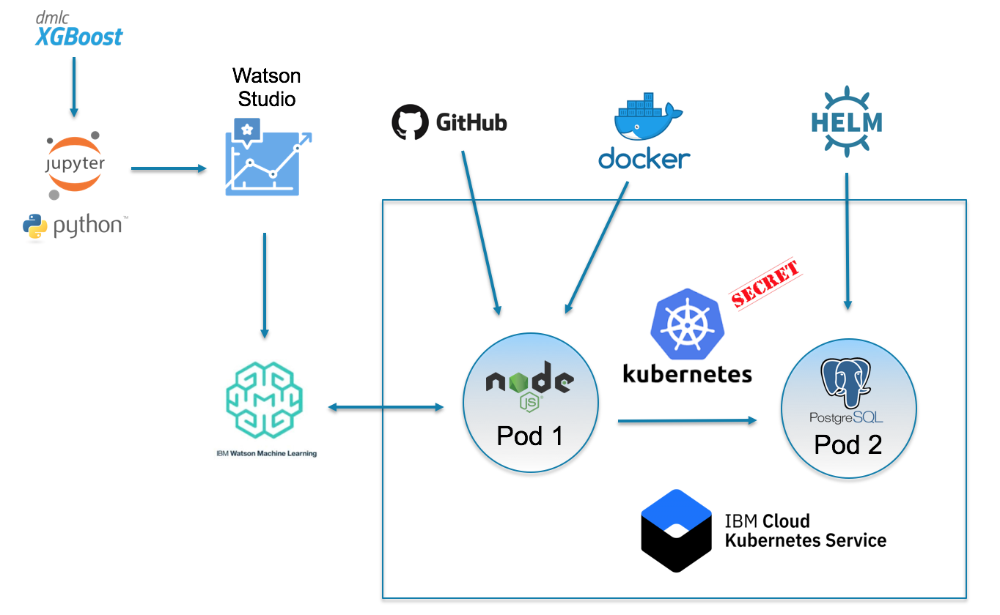
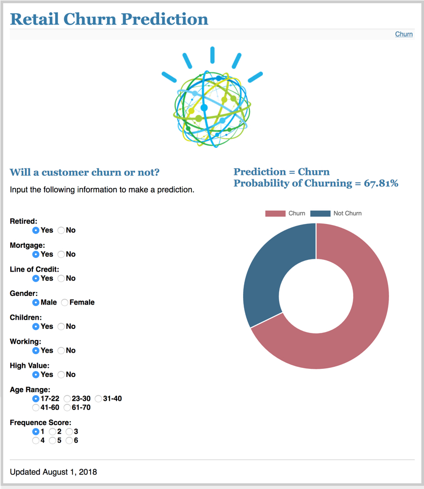
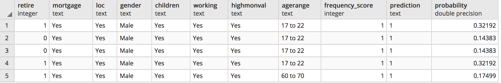

# MACHINE LEARNING ON IBM CLOUD

## Overview

This repository contains a set of assets to demonstrate the development and deployment of a cognitive application on IBM Cloud. In this demonstration, you will build a machine learning model to predict the likelihood that a retail customer will churn, deploy a cognitive application that employs this model to score customers on their likelihood to churn, and store the scoring results in a database for further analysis.

The demo begins with ingesting two data sets - one with customer demographic information and the other with customer transaction history, joining, cleansing, and preparing the data for machine learning, training and evaluating a machine learning model to predict customer churn, and deploying the model as a REST API endpoint. An application is then deployed that hits this endpoint to score customers based on the highly predictive features on which the model was trained. Results of each scoring request are then stored in a database.

## Demo Flow

In this demo, you will use IBM Watson Studio to develop the retail churn machine learning model in a Jupyter notebook. The Jupyter notebook is written in Python and utilizes Pandas, scikit-learn and XGBoost to cleanse the data, transform it, and learn a machine learning model. 

IBM Watson Machine Learning (WML) is then used a repository for storing the model and deploying it as a publically accessibe REST API endpoint.

A Node.js web application used to score the model is containerized, deployed in Kubernetes on the IBM Cloud Kubernetes Service, and its URL made publically accessible so that it can be accessed in any brower over the internet. A PostgreSQL database is also deployed in the IBM Cloud Kubernetes Service. The Node.js application writes the scoring request and the predictions from the deployed machine learning model in WML into the database.

The Node.js web application that you will deploy in Kubernetes to score the model looks like this.

Upon scoring customers with the web application, the feature values scored along with the model prediction results, both the churn prediction as well as the probability of chrun are inserted into a PostgreSQL database table. The table columns correpond to the nine features used to train the model along with two additional columns for the prediction result and the probability.

## Prerequisites

* IBM Cloud account
	* <https://console.bluemix.net/>
* Watson Studio account
	* <https://dataplatform.cloud.ibm.com/>

## Preliminaries

1. Create a Watson Studio project
3. Provision a Free IBM Cloud Kubernetes service

## Instructions

### Build, save and deploy the machine learning model

In Watson Studio

* Create a project
* Add a WML service to the project
* Create a notebook from the .ipynb file included in this repository
* Insert the credentials with the WML service you just provisioned into the notebook
* Run all cells in the notebook

You should now have a model and deployment in your project

 